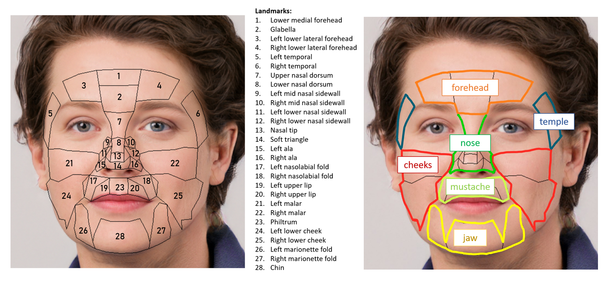

# Landmark rPPG 


This code is built upon the pyVHR framework by Bocconi et al. : 
- Boccignone, Giuseppe & Conte, Donatello & Cuculo, Vittorio & D'Amelio, Alessandro & Grossi, Giuliano & Lanzarotti, Raffaella & Mortara, Edoardo. (2022). pyVHR: a Python framework for remote photoplethysmography. PeerJ Computer Science. 8. e929. 10.7717/peerj-cs.929. 
- Boccignone, Giuseppe & Conte, Donatello & Cuculo, Vittorio & D'Amelio, Alessandro & Grossi, Giuliano & Lanzarotti, Raffaella. (2020). An Open Framework for Remote-PPG Methods and their Assessment. IEEE Access. 8. 216083-216103. 10.1109/ACCESS.2020.3040936. 

On top of the functionalities of pyVHR, it allows for extracting rPPG from anatomical landmarks.
(Face image from: This person does not exist https://this-person-does-not-exist.com/en)


The goal of this project is to compare the performance of the rPPG extraction from the use of a single landmark to the use of multiple landmarks.

# Installation

To install the package, you can use the following command:
```bash
conda env create --name envname --file=gpu_pyvhr.yml
```

# Usage

For more details on the use of the pyVHR framework, please refer to the original documentation: https://github.com/phuselab/pyVHR 

Run the following code to run the pipeline with landmarks:
```python
from pyVHR.analysis.pipelineLandmarks import PipielineLandmarks

# params
wsize = 10                  # window size in seconds
roi_approach = 'landmark'   # 'holistic' or 'patches'
sampling_method = 'random'  # sampling approach to the pixels inside the landmark: 'random' or 'all'
nb_sample_points = 2000      # number of sample points
bpm_est = 'clustering'     # BPM final estimate, if patches choose 'medians' or 'clustering'
methods = ['cpu_CHROM']     # one of the methods implemented in pyVHR

# video params
dataset_name = 'MR_NIRP'  # dataset name from MR_NIRP, LGI_PPGI or UFC_PHYS
videoIdx = 0                # video index in the dataset
landmarks = ['glabella', 'chin', 'left_malar', 'right_malar'] # landmarks to use

# run
pipe = PipielineLandmarks()    # object to execute the pipeline
res = pipe.run_pipeline(dataset_name, 
                        videoIdx, 
                        res=None, 
                        landmarks=landmarks, 
                        roi_approach=roi_approach, 
                        sampling_method=sampling_method, 
                        nb_sample_points=nb_sample_points, 
                        winsize=winsize, 
                        methods=methods, 
                        visualize=True, 
                        verb=True, 
                        cuda=True)

# ERRORS
res.dataFrame
```

## Notebooks

The notebooks_landmark folder contains examples of how to use the pipeline with landmarks on the datasets MR_NIRP, LGI_PPGI and UBFC_PHYS.
- dataset_inspection.ipynb: Preprocess the data from the public datasets based on thier PPG singal quality.
- pipeline.ipynb: Example of how to use the pipeline with landmarks on a video.
- extract_landmarks.ipynb: Example of how to extract landmarks from all videos of a dataset and save the intermediate RGB results.
- analyze.ipynb: Example of how to compare the results of the pipeline with individual landmarks to the results of the pipeline with multiple landmarks.

# Results

We compared the performance for rPPG and HR extraction for different Regions Of Interest (ROIs) based on the DTW and MAE metric. 
The results are saved in the result folder.
Our results show that:
- The best landmark when using a single landmark is the glabella.
- The use of multiple landmarks improves the performance of the rPPG extraction compared to the use of a single landmark.
- The best combination when considering both still and motion videos is the use of: glabella, lower cheek, lower lateral forehead and malar. 


# Datasets

- UBFC_PHYS: https://ieee-dataport.org/open-access/ubfc-phys-2
- LGI_PPGI: https://github.com/partofthestars/LGI-PPGI-DB
- MR_NIRP: https://computationalimaging.rice.edu/mr-nirp-dataset/ 

## Contact 

If you have any questions, please feel free to contact me through email (emilie.rlpg@gmail.com or moe.elgendi@hest.ethz.ch).

## Authors and acknowledgment
This research project was supervised by Dr. Mohamed Elgendi and Prof. Dr. Carlo Menon. The code was developed by Emilie Rolland-Piegue. Also thank to all of the BMHT members and providers of datasets for the continuous help!

## License

MIT License
